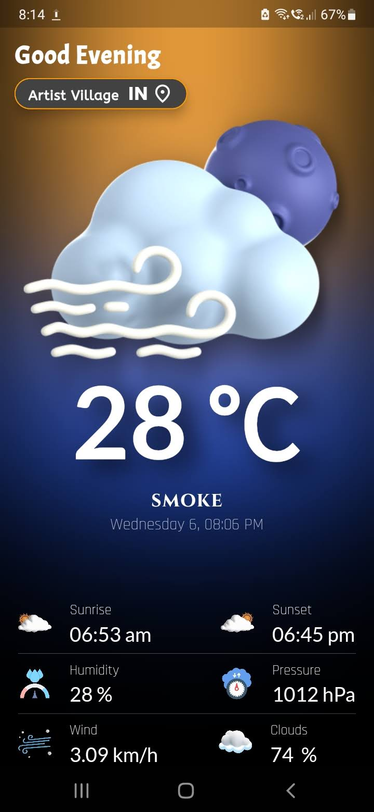

# INTERNSHIP-1 (App Development)

## Bharat Intern 

Welcome to my app development internship at Bharat-Intern! In this internship, I've developed two Flutter applications: a to-do list app and a weather forecast app. This is the readme file of Weather Forecast app.

## Weather Forecast App

The weather forecast app provides real-time weather information for users. Here are some key features:

- **Real-Time Weather**: The app displays real-time weather data based on the user's current location.
- **Location Switching**: Users can switch locations to view weather forecasts for different places.
- **API Integration**: The app uses an API to fetch weather data and display it to the user.

### Screenshots

## Contribution

### Open for pull requests || Raising issues

Feel free to contribute to the improvement of these apps by opening issues or submitting pull requests.
